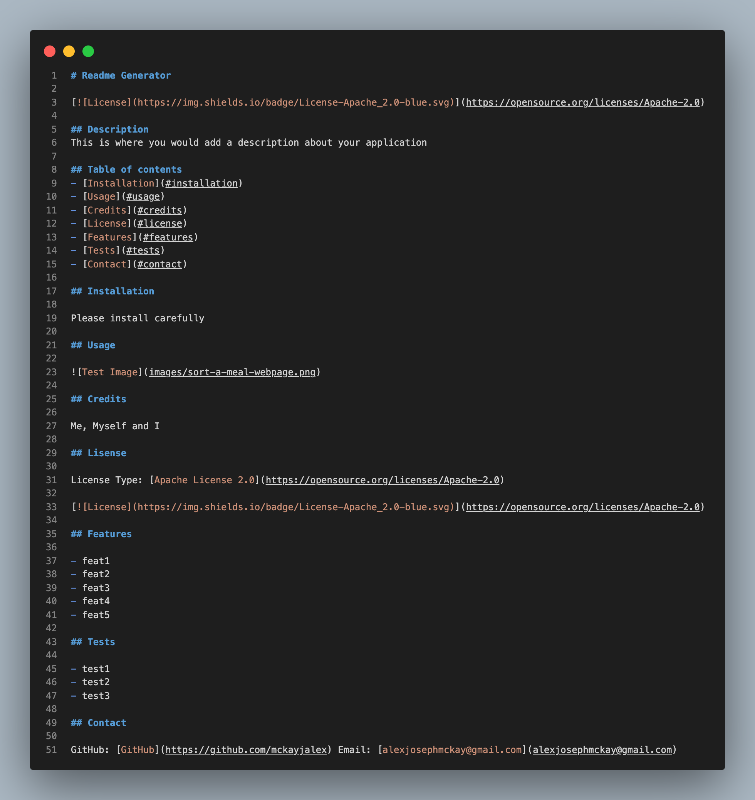

# Week9-Homework

# Readme Generator

## Description 

Week 9 Homework at Adelaide Uni Coding Bootcamp was to create a readme.md file generator using the command line and node.js.
The User is asked multiple questions, once all are answered then a README.md file is created with the data you have supplied.

## Table of contents 
- [Resources](#resources) 
- [Screenshots](#screenshots) 
- [Contact](#contact)

## Resources

Walkthrough Video
[Walkthrough Video](https://youtu.be/W8CPssL9gTQ)

Sample Readme
[Sample readme]([images/raw-readme.png](https://github.com/mckayjalex/readme-generator/blob/main/sampleREADME.md))

## Screenshots 

Code

Command Line

## Contact

GitHub: [GitHub](https://github.com/mckayjalex) Email: [alexjosephmckay@gmail.com](alexjosephmckay@gmail.com)