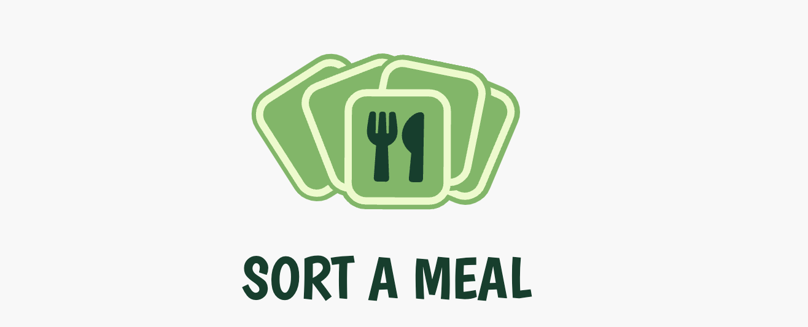

# Readme Generator

## Description 
This is where you would add a description about your application

## Table of contents 

- [Installation](#installation) 
- [Usage](#usage) 
- [Credits](#credits) 
- [License](#license)
- [Features](#features)
- [Tests](#tests)
- [Contact](#contact)

## Installation

Please install carefully

## Usage 

## Credits

Me, Myself and I

## Lisense

License Type: [Apache License 2.0](https://opensource.org/licenses/Apache-2.0)

## Features

- feat1
- feat2
- feat3
- feat4
- feat5

## Tests

- test1
- test2
- test3

## Contact

GitHub: [GitHub](https://github.com/mckayjalex) Email: [alexjosephmckay@gmail.com](alexjosephmckay@gmail.com)